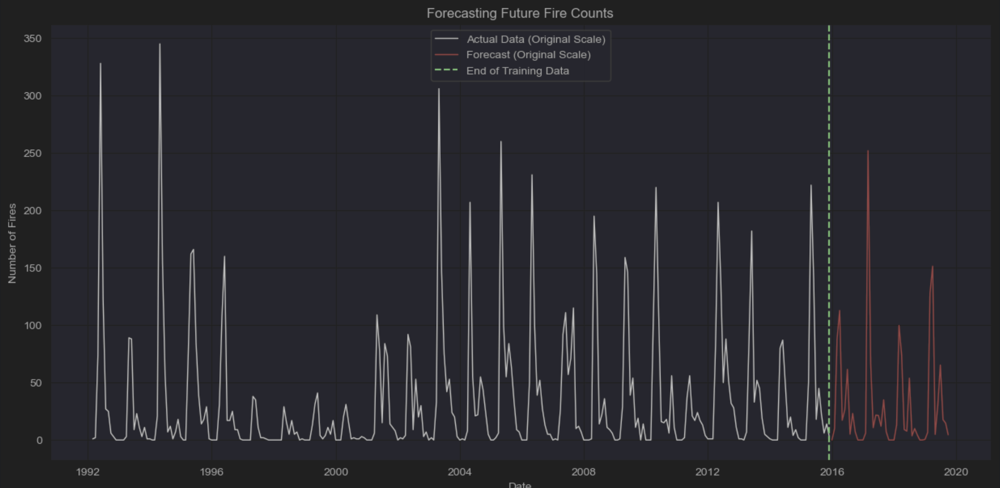
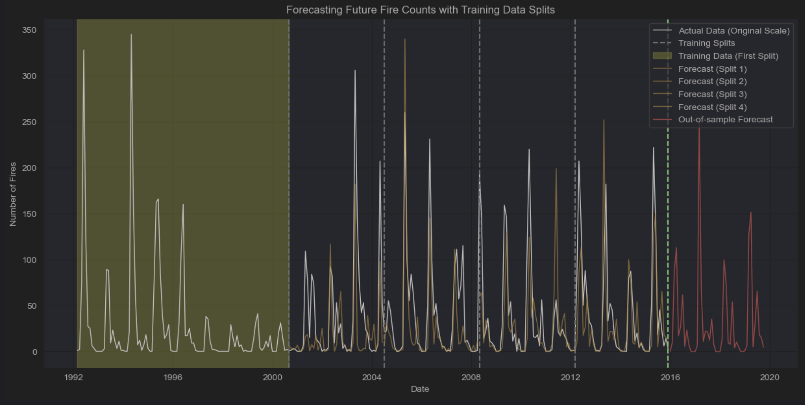

# Fire-Occurrence-SARIMAX-Model

Original Data Sources Links:

*   **Fire Data**  https://www.kaggle.com/datasets/rtatman/188-million-us-wildfires/data

Important Features Descriptions
1.   FIRE_SIZE = Estimate of acres within the final perimeter of the fire.
2.   FIRE_SIZE_CLASS = Code for fire size based on the number of acres within the final fire perimeter expenditures (A=greater than 0 but less than or equal to 0.25 acres, B=0.26-9.9 acres,
     C=10.0-99.9 acres, D=100-299 acres, E=300 to 999 acres, F=1000 to 4999 acres, and G=5000+ acres).
3.   FIPS_NAME = County name from the FIPS publication 6-4 for representation of counties and equivalent entities.
4.   CONT_DATE = Date on which the fire was declared contained or otherwise controlled (mm/dd/yyyy where mm=month, dd=day, and yyyy=year).
5.   CONT_DOY = Day of year on which the fire was declared contained or otherwise controlled.
6.   STAT_CAUSE_CODE = Code for the (statistical) cause of the fire.
7.   DISCOVERY_DATE = Date on which the fire was discovered or confirmed to exist.

*   **Temperature Data** https://www.ncei.noaa.gov/access/monitoring/climate-at-a-glance/global/time-series/northAmerica/land/ytd/0/1940-2024?filter=true&filterType=binomial
*   **Extreme Temperature** https://mitracking.state.mi.us/
Michigan fire data can be found here: 

### Prediction Result

### Prediction With Training Data Allocation and Partitions

## Motivations
Efforts in modeling began with an Augmented Dickey-Fuller test to check just how stationery our data was.

Aggregating the fires into monthly counts allowed for a result below:\
**ADF Statistic:** -3.036582\
**p-value:** 0.031616\
**Critical Values:**\
&nbsp;&nbsp;&nbsp;&nbsp;&nbsp;&nbsp;&nbsp;&nbsp;1%: -3.455\
&nbsp;&nbsp;&nbsp;&nbsp;&nbsp;&nbsp;&nbsp;&nbsp;5%: -2.872\
&nbsp;&nbsp;&nbsp;&nbsp;&nbsp;&nbsp;&nbsp;&nbsp;10%: -2.572

An ADF works on the assumption that a dataset is stationary in the likely absence of a unit root. Non-stationary data would in turn produce a value signifying a unit root which would indicate no observable pattern over time. Since our results indicate that our p-value is below .05 and above .01 and our 5%-10% critical value significance levels meaning that the model is around 96%-97% confident in its rejection of the null-hypothesis. Using this observation allows us to proceed under the  assumption that an observable pattern can be gleaned from the provided data stream.
ACF and PACF plots were used to determine the seasonality of the aggregated monthly fire counts and help in identifying parameters for the SARIMAX model. A SARIMAX model is an extension on the ARIMA model with S standing for seasonal and X standing in for the ability to include an exogenous variable in considerations when training the model. Early iterations indicated that the model was not capturing the seasonality of the data. Fourier Terms were considered and introduced since the seasonal patterns in the data were complex and difficult to capture with SARIMAX’s built in auto-regression algorithm. Used in conjunction with this algorithm as an exogenous variable the parameters for the number of harmonics(k) was fine-tuned for the best performance possible with this specific configuration of the SARIMAX implementation. Since the data set is so small Sequential-Cross Validation was used to assist in validating training data to test data as we looped through the splits which were numbered and decided on via trial and error for the best achievable MSE RMSE and MAE error values which are displayed below.

Mean MSE over all folds: 1767.3487679521563\
Mean RMSE over all folds: 41.78849553946296\
Mean MAE over all folds: 24.937084218581894\

We were granted the best results when we would train the model on the log transformed monthly fire and needed to perform an exponential log transformation to inverse both our forecasted values and our tested and trained values to accurately represent the forecasted and training and testing data accurately for visualization. 
